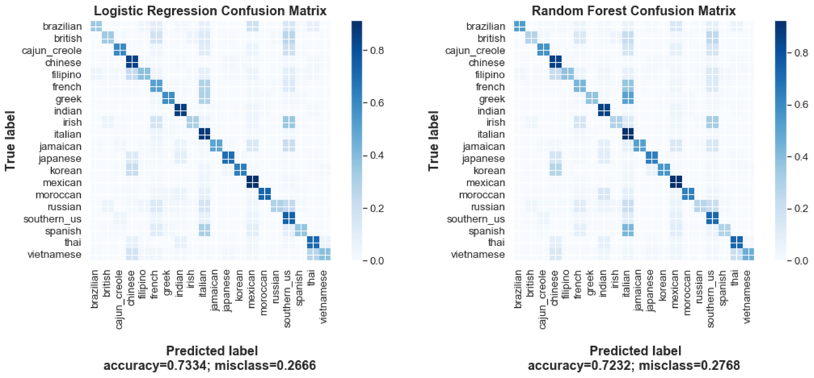

# Recipe2Cuisine

As a member of the data team at an online publishing company, one of my verticals is a food publication. The product manager of the team wanted to build a feature for this vertical that enables users to query by cuisine, not just by ingredients. Specifically, recipes can be unlabeled and it's infeasible to label them by hand. Luckily, we have a training set of about 40,000 recipes with labeled cuisines. The goal of this project is to design and execute a method to predict the cuisine of a recipe given only its ingredients.

## Data

A list of cuisine-labelled recipes is stored in a dataframe (39774 rows). Ingredients for each recipe are provided as strings. A total of 20 different cuisines are present 

###

## EDA
Exploratory data analysis was performed. Figure below represent how many ingredients each of the 20 cuisine typically contains. 

## Pre-processing and TF-IDF
Texts of the 

## Models
Logistic regression and random forest classifier were used as modelling techniques for classify each recipe to 

## Evaluation of Model
To evaluate how well our model performs, confusion matrices, accuracy and F1-scores were computed. Overall, it appears we are able to classify recipes as one of twenty cuisines with an accuracy up to . Furthurmore, it allows us to implement querying by cuisine

