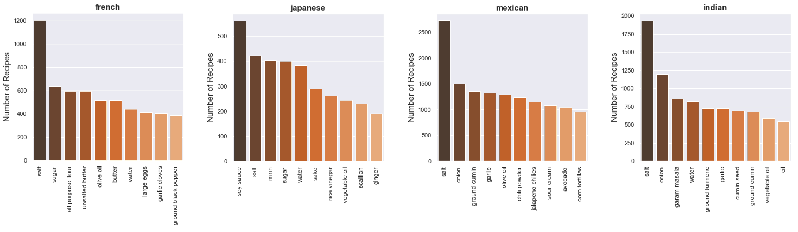

# Recipe2Cuisine

Being stuck in traffic can be extremly frustrating. The increased carbon dioxide emissions associated with congestions have also been shown to pose health threats to the general population. Moreover, the constant stop-and-go motions also attract greater chances of collisions. On top of all this, traffic delays are costly not only to individual households, but also to cities on the scale of hundreds of millions of dollars. Thus, to be able to predict traffic ahead of time presents multiple significant advantages. For example, cities can better allocate resources for designing smoother routes; delivery and rideshare companies can be more on-time with their services; advertisement companies can predict hubs of traffic to place their ads. Thus, the purpose of this project is to generate a model that can predict traffic in downtown Toronto.

## Recipe Data

Travel time data on streets and highways across the city of Toronto were used for this project. Specifically, data recorded from Bluetooth and Wifi sensors at 5-minute intervals were used. Information were derived from single locations whenever a mobile deivce or vehicle passes by the sensors.
###

## EDA

###

## TF-IDF
Several features were narrowed down to predict travel times: Day of the week, Hour of the day, Holidays, Weather conditions (temperature, visibility, and snow presence), Toronto Raptors', Blue Jays' and Maple Leafs' games and events hosted at the Scotiabank arena. Correlation matrix between features below presents a sample features of how they are correlated to each other.

## Models
Random forrest regressions were used to predict travel times in downtown Toronto. Datasets were split 75% and 25% into train and test datasets respectively. Hyperparameter tuning was performed where a random search was first initiated. With the random search results, a grid search was performed with 3-fold cross validation to obtain the optimized paramaters for the model. Evaluations of the model performances were subsequently performed on the test dataset using several metrics including mean squared error, mean absolute error and R2.

## Evaluation of Model
Give that the webapp is deployed, there are several key performance indicators that can be used to evaluations. For example, how far do the accuracy of the predictions deviate from the needs of the companies? Are traffic delays reduced after the deployment of the webapp? and how many users are using this webapp? Additionally, the ability to predict car traffic in this project can be generalized to other domains as well: network traffic, social traffic and even population flow. 

